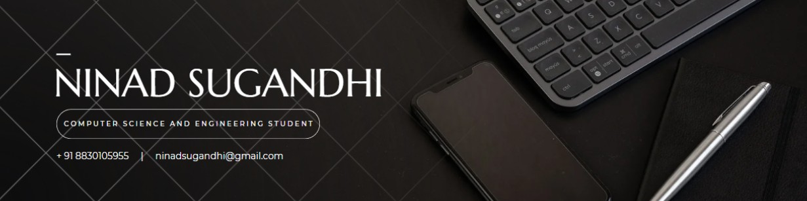

# SubGeneratorAI
# **Abstract**
The rapid growth of multimedia content has created a need for efficient subtitle generation and translation to enhance accessibility and reach global audiences. This system leverages cutting-edge technologies to automate the process of transcribing, translating, and captioning multimedia files. The motivation stems from the challenge of manually generating accurate subtitles and translations, which is labor-intensive, error-prone, and lacks scalability. The proposed solution addresses this by combining state-of-the-art automatic speech recognition (ASR), neural machine translation (NMT), and natural language processing (NLP) techniques.

### **Keywords**
- **LLM**
- **JSON**
- **SRT**
- **Transcription**
- **Translation**
- **Summarization**
- **Fine-tune**

---

# **I. INTRODUCTION**

## **A. Motivation**
In today's digital landscape, multimedia content has become ubiquitous, spanning various platforms and catering to diverse audiences worldwide. However, language barriers often hinder accessibility and comprehension, limiting the reach and impact of such content. To address this challenge, a sophisticated Subtitle Generator and Translator has been developed, offering a comprehensive solution for transforming and enhancing multimedia content. 

This research introduces an innovative AI solution tailored for digital content creators — a Subtitle Generator and Translator designed to address the growing need for accessible and multilingual content. Utilizing advanced Natural Language Processing (NLP) and machine translation techniques, including transformer architectures and recurrent neural networks, our system autonomously generates precise subtitles and seamlessly translates them into multiple languages.

This innovative technology holds immense potential for revolutionizing the field of education by breaking down language barriers and making educational multimedia content accessible to learners across the globe.

---

## **B. Purpose and Functionality**
At its core, the Subtitle Generator and Translator leverage advanced Natural Language Processing (NLP) algorithms to perform two crucial functions: **transcription** and **translation**. 

### **1. Transcription**
The transcription process meticulously converts audio content into textual format, capturing linguistic nuances such as accents and dialects with remarkable accuracy.

### **2. Subtitle Generation**
Building upon the transcribed text, the tool's subtitle generation functionality comes into play, enhancing the viewing experience for users, particularly those with auditory impairments.

### **3. Translation**
Moreover, the technology extends its capabilities beyond mere transcription and subtitle generation by offering robust translation services.

### **4. Global Accessibility**
Through integration with Google Translate's Neural Machine Translation (NMT) algorithms, the tool empowers users to translate subtitles into a myriad of languages.

---

## **C. Objectives**
- **Efficient Subtitling**: Develop an AI-driven system that can rapidly and accurately generate subtitles in real-time.
- **Multilingual Translation**: Implement advanced machine translation techniques for global accessibility.
- **Adaptability to Diverse Content**: Handle diverse audiovisual contexts, including varying speaking rates and background noise.
- **User-Friendly Interface**: Design an intuitive interface for easy customization of subtitles.
- **Enhanced Accuracy**: Use state-of-the-art NLP models for accurate transcription and translation.
- **Accessibility Improvement**: Provide automated and accurate subtitles to cater to a global audience.
- **Technological Advancement**: Incorporate the latest AI models to continually improve the system's capabilities.

---

## **D. Methodology Used**
The research embraces a comprehensive methodology, strategically integrating AssemblyAI's transcription, Google Translate's NMT, and the T5 Transformer Model's summarization techniques.

### **1. AssemblyAI Transcription**
AssemblyAI's transcription algorithms serve as the initial step in the process, accurately transcribing audio content into textual format with a high degree of precision.

### **2. Google Translate's NMT**
Following transcription, Google Translate's NMT techniques come into play, facilitating seamless translation of the transcribed text into multiple languages.

### **3. T5 Transformer Summarization**
Simultaneously, the T5 Transformer Model's summarization techniques are employed to distill the transcribed text into concise summaries.

---

# **II. PROPOSED WORK**

### **A. Data Source**
Data gathering begins with multimedia content primarily from YouTube or Google Drive. The data is obtained using the YouTube API or by uploading files from Google Drive.

### **B. Functionality of the Project**

#### **1. Transcription and Caption Generation**
- Transcription of audio data is accomplished via the AssemblyAI transcription service.
- The transcript is transformed into caption formats (SRT) using custom Python scripts.

#### **2. Translation**
- Transcripts are translated into the desired language using the Google Translate API.
- NMT algorithms ensure the preservation of context and semantic meaning.

#### **3. Summarization**
- Transcribed text is summarized using the T5 transformer model, enhancing content digestibility.

### **C. Algorithms Used**
1. **AssemblyAI Transcription**: Utilizes CNNs and RNNs for accurate transcription.
2. **Google Translate**: Employs NMT algorithms for precise translation.
3. **T5 Summarization**: Uses transformer architecture for effective summarization.

### **D. Custom Model Integration and Architecture Overview**
The system integrates a fine-tuned T5 Model for enhanced summarization and transcription capabilities.

Unleash the potential of SubGeneatorAI on GitHub and revolutionize the way subtitles are generated in your applications and projects. The collaborators to this project are <a href = "https://github.com/AadhithSridharan">Aadhith Sridharan</a> and <a href = "https://github.com/codewithpassion-ninad">Ninad Sugandhi</a>.

  

